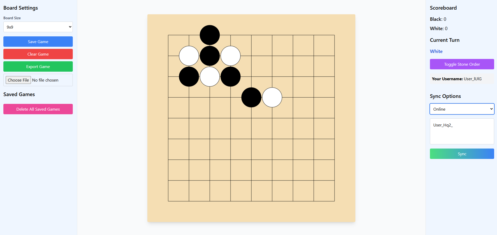

# Go Game



Welcome to **Go Game** – a modern, interactive implementation of the classic board game Go, built with TypeScript, Express, Webpack, and Socket.io.

## Overview

Go Game offers:
- A dynamic, browser-based Go board with a sleek UI.
- Real-time multiplayer capabilities using Socket.io.
- Game state management and encryption for saving/loading games.
- Clean, modular code organized with TypeScript and bundled via Webpack.

This README will guide you on installing the project's dependencies and building the application bundle.

## Prerequisites

Before getting started, ensure you have the following installed:

- [Node.js](https://nodejs.org/) (v12 or later)
- [npm](https://www.npmjs.com/) (comes bundled with Node.js)

## Installation

Clone the repository and install the necessary npm modules:

```bash
git clone https://github.com/hkder/go-single.git
cd go-game
npm install
```

## Building the Project

### Bundle the Application with Webpack

Create the production-ready bundle with:

```bash
npm run bundle
```

Webpack will bundle your application (starting from `./src/main.ts`) and output the final JavaScript file into the `public` directory.

## Running the Application

Once you have built the project, you can start the server to run the application.

```bash
npm start
```

By default, the server will be available at [http://localhost:3000](http://localhost:3000). Open this URL in your browser to start playing!

## Development Tips

- **Auto-Rebuild:** Consider using `webpack --watch` during development to automatically recompile TypeScript files when changes are made.
- **Scripts:** Customize or add npm scripts in `package.json` to streamline your workflow.

## Contributing

Contributions are always welcome! To contribute:

1. Fork this repository.
2. Create a new branch for your feature:  
   ```bash
   git checkout -b feature/your-feature-name
   ```
3. Commit your changes with descriptive messages.
4. Push your branch and submit a pull request for review.

## License

This project is licensed under the MIT License. See the [LICENSE](LICENSE) file for details.

## Acknowledgements

- [Express](https://expressjs.com)
- [Socket.io](https://socket.io)
- [TypeScript](https://www.typescriptlang.org)
- [Webpack](https://webpack.js.org)
- [Tailwind CSS](https://tailwindcss.com)

Enjoy the game, and happy coding!
